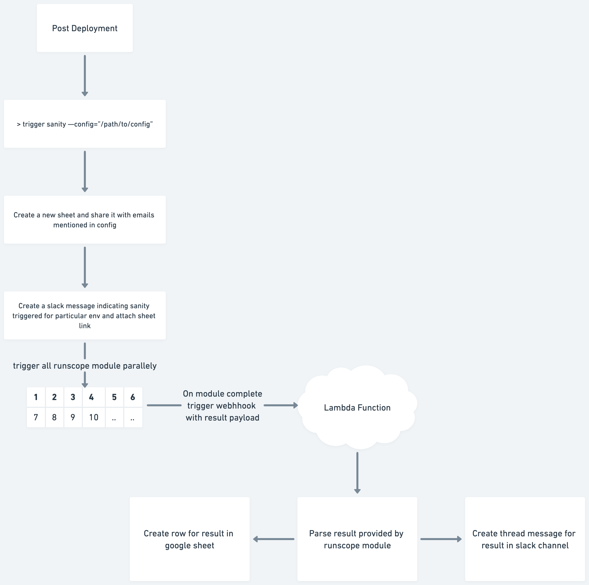

# Runscope Sanity trigger
<!-- toc -->
* [Usage](#usage)
* [Commands](#commands)
* [Config File](#config-file)
<!-- tocstop -->
# Usage
<!-- usage -->
```sh-session
$ npm install -g runscope-sanity-runner
$ trigger COMMAND
running command...
$ trigger (--version)
runscope-sanity-runner/1.0.0 darwin-arm64 node-v16.20.0
$ trigger --help [COMMAND]
USAGE
  $ trigger COMMAND
...
```
<!-- usagestop -->
# Commands
<!-- commands -->
* [`trigger sanity`](#trigger-sanity)

## `trigger sanity`

This command helps users to trigger runscope tests and send slack messages.

```
USAGE
  $ trigger sanity -c <value>

FLAGS
  -c, --config=<value>  (required) Path to config file

DESCRIPTION
  This command helps users to trigger runscope tests and send slack messages.

EXAMPLES
  $ trigger sanity --config="./config.json"
```

_See code: [src/commands/sanity/index.ts](https://github.com/hiteshshetty-dev/runscope-sanity-runner/blob/v1.0.0/src/commands/sanity/index.ts)_
<!-- commandsstop -->

# Config File
The following is a sample for config file

```JSON
{
    "slackDetails": {
        "apiToken": "xoxb-*******-*********-********",
        "channel": "**********"
    },
    "runscopeDetails": {
        "envName": "*****",
        "envUid": "******-****-****-****-**********",
        "triggerUids": ["********-****-****-****-************"],
        "webhookUrl": "********"
    },
    "shareReportToFollowingUsers": ["hitesh.shetty@contentstack.com"],
    "googleCredentialsPath": "credentials.json"
}
```

Before using the CLI command, you need to set up a configuration file. Here's an explanation of each field in the configuration file:

* slackDetails: Contains details required for interacting with Slack.
  * apiToken: Your Slack API token.
  * channel: The Slack channel where notifications will be sent.
* runscopeDetails: Contains details required for integrating with Runscope.
  * envName: The name of the environment.
  * envUid: The UID of the environment.
  * triggerUids: An array of trigger UIDs.
  * webhookUrl: The URL for the webhook.
* shareReportToFollowingUsers: An array of email addresses to which reports will be shared.
* googleCredentialsPath: The file path to your Google credentials JSON file.

## Retrieving Configuration Details

Here's how you can retrieve each detail required for the configuration file:

**Slack API Token**: Generate a Slack API token by following the official Slack API documentation. Ensure the token has appropriate permissions for sending messages to the specified channel.

**Runscope Details**: Obtain Runscope environment details (name, UID, trigger UIDs) from your Runscope account settings or API documentation.

* Environment name and Uuid:
  
* Trigger Uid: You can copy trigger uid from setting for each module
  
* [Webhook URL](lambdaFunction/Readme.md)


**Share Report Recipients**: Specify the email addresses of users to whom reports should be shared.

**Google Credentials Path**: Obtain Google credentials JSON file from the Google Cloud Platform Console or by following the Google API documentation.

## Understanding the flow


